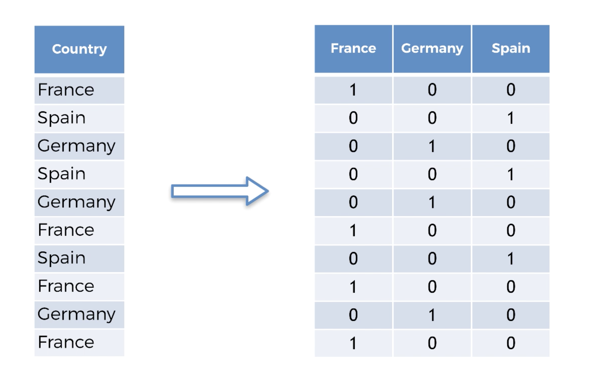

# Learning Machine Learning
A repo dedicated to learning machine learning in both Python and R. This is based on the online course from [Udemy](https://www.udemy.com/machinelearning/)

## Contents
- [Setup](#setup)
- [Importing the libraries](#importing-the-libraries)

### Setup
- Python
  - [Python Language](https://www.python.org/downloads/)
  - [Anaconda-Navigator (Spyder is the IDE)](https://www.anaconda.com/download/)
- R
  - [R programming language](https://cran.r-project.org/mirrors.html)
  - [R Studio](https://www.rstudio.com/products/rstudio/download/)

### General Code Styles
- R
  - Use `<-` for assignment
  - Use periods `.` to separate words in variable names
    - `my.variable <- 5`
- Python
  - Use `=` for assignment
  - Using underscores `_` to separate words in functions and variable names
    - `my_variable = 5`

### Running code in the console
This is the same for both R and Python. **Highlight** (or the entire file) the selected portion of 
the code you want to run, then hit `Command + Enter`

### Importing the libraries
**Python**  

```Python
import numpy as np                # Matematical tools
import matplotlib.pyplot as plot  # Plotting tools 
import pandas as pd               # Import and manage datasets
```

The keyword `as` lets us use custom shortcut names for out packages.

**R**  
```R
# Quotes required. This is only done once per machine, and is usually done in the console rather than the R script.
install.packages('packagename') 

# This calls the package being used and imports all the functions for that package.
library(packagename) 
```
R has most of these already built in, but there will be some packages in the future that we're going to need. This is how we're going to install everything.

### Setting the current working directory
This is a really important step. The file reader needs to know which directory to start as a reference. You can change that
in the settings. In **Spyder**, the default current working directory is set to whatever directory the file explorer is in. You can switch into the folder where the data is by clicking into it. You can manually set a folder location in the settings as well.

### Reading a Dataset
**Python**
```Python
# We have our working directory set where this data file is. Your directory may look different 
# depending on how you set yours up
dataset = pd.read_csv('Data.csv')
```

**R**
```R
dataset <- read.csv('Data.csv')
```

### Preparing Data
In Python, we have to distinguish between the matrix of features and the dependent variable vector. In our case, we need
the `Country`, `Age`, and `Salary` observations (our x variables).

```Python
# Preparing the data
# We need to separate the independent (x) variables from the dependent (y) ones
# Rows are on the left of the comma, and cols are on the right
# : Means range. num:num
x = dataset.iloc[:, :-1].values # We want all the rows, and every column exept the last one
y = dataset.iloc[:, 3].values # We want all the tows, but only the 3rd column
```
### Dealing With Missing Data
**Python**
```Python
# Taking care of missing data
from sklearn.preprocessing import Imputer
imputer = Imputer(missing_values = 'NaN', strategy = 'mean', axis = 0) # looking for values that are NaN and replacing them with the mean
imputer = imputer.fit(x[:, 1:3]) # fixing all rows of cols 1 and 2
x[:, 1:3] = imputer.transform(x[:, 1:3]) # set the x data to the fixed table
```

**R**
```R
ReplaceColWithAverage <- function(col) {
  # ifelse is basically a ternary operator
  new.col <- ifelse(is.na(col),
                    ave(col, FUN = function(x) mean(x, na.rm = TRUE)),
                    col)
  return(new.col)
}

# $ symbol grabs the column by name
dataset$Age <- ReplaceColWithAverage(dataset$Age)
dataset$Salary <- ReplaceColWithAverage(dataset$Salary)
```

### Encoding Categorical Data
Machine learning uses algorithms that deal with numbers, so nominal data won't work that well here. We have to encode it.  


**Python**
```Python
from sklearn.preprocessing import LabelEncoder, OneHotEncoder

le_x = LabelEncoder()
x[:, 0] = le_x.fit_transform(x[:, 0])

le_y = LabelEncoder()
y = le_x.fit_transform(y)

ohe = OneHotEncoder(categorical_features = [0])
x = ohe.fit_transform(x).toarray()
```

**R**
```R
FactorizeCol <- function(col, givenLevels, givenLabels) {
  new.col <- factor(col, levels = givenLevels, labels = givenLabels)
  return(new.col)
}

dataset$Country <- FactorizeCol(dataset$Country, c('France', 'Spain', 'Germany'), c(1, 2, 3))
dataset$Purchased <- FactorizeCol(dataset$Purchased, c('No', 'Yes'), c(0, 1))
```

### Splitting data into a training set and a testing set
In order for the machine to learn, we need to train it with data, and test it against some data.  
  
**Python**
```Python
from sklearn.cross_validation import train_test_split
x_train, x_test, y_train, y_test = train_test_split(x, y, test_size = 0.2, random_state = 0)
```
We're setting the random state just to have the same random results for learning purposes. Test size is typically **20%**.  
  
**R**
```R
library(caTools)
set.seed(123) # this is for learning purposes, keeping the results the same

# This uses the train set as the ratio (Python uses the test one, so we did 0.2)
split <- sample.split(dataset$Purchased, SplitRatio = 0.8)
training.set <- subset(dataset, split == TRUE)
test.set <- subset(dataset, split == FALSE)
```

### Feature Scaling
In machine learning, we need our features of the same scale. As it stands, age ranges in the 0-100 scale, and salary
ranges from 0-100000. The categorical data that was converted to ordinal data do not need to be converted.  
  
**Python**
```Python
from sklearn.preprocessing import StandardScaler
scale_x = StandardScaler()
## Recompute because we want it scaled
x_train = scale_x.fit_transform(x_train)
x_test = scale_x.fit_transform(x_test)
```

**R**
```R
## Need to exclude the 'factors', because they're not numeric.
## The factors are the categorical data that we transformed earlier
training.set[, 2:3] <- scale(training.set[, 2:3])
test.set[, 2:3] <- scale(test.set[, 2:3])
```

### The Template We Need
So far, we've created a template for us to work in. However, not all of the things we did were completely necessary,
so we'll just include the basics of what we need.  
  
**Python**
```Python
# Importing the libraries
import numpy as np
import matplotlib.pyplot as plt
import pandas as pd

# Importing the dataset
dataset = pd.read_csv('Data.csv')
X = dataset.iloc[:, :-1].values
y = dataset.iloc[:, 3].values

# Splitting the dataset into the Training set and Test set
from sklearn.cross_validation import train_test_split
X_train, X_test, y_train, y_test = train_test_split(X, y, test_size = 0.2, random_state = 0)

# Feature Scaling
"""from sklearn.preprocessing import StandardScaler
sc_X = StandardScaler()
X_train = sc_X.fit_transform(X_train)
X_test = sc_X.transform(X_test)
sc_y = StandardScaler()
y_train = sc_y.fit_transform(y_train)"""
```

**R**
```r
# Importing the dataset
dataset = read.csv('Data.csv')

# Splitting the dataset into the Training set and Test set
# install.packages('caTools')
library(caTools)
set.seed(123)
split = sample.split(dataset$DependentVariable, SplitRatio = 0.8)
training_set = subset(dataset, split == TRUE)
test_set = subset(dataset, split == FALSE)

# Feature Scaling
# training_set = scale(training_set)
# test_set = scale(test_set)
```
