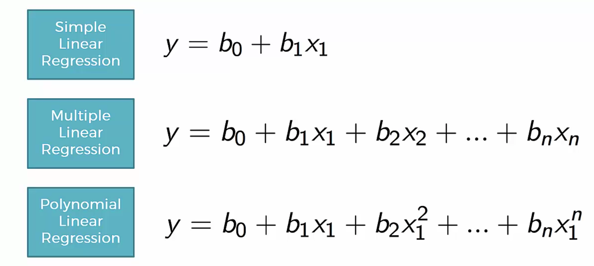

# Learning Machine Learning
A repo dedicated to learning machine learning in both Python and R. This is based on the online course from [Udemy](https://www.udemy.com/machinelearning/). The data for the modules can be found [here](https://www.superdatascience.com/machine-learning/).

## Contents
- [Setup](#setup)
- [Importing the libraries](#importing-the-libraries)

### Setup
- Python
  - [Python Language](https://www.python.org/downloads/)
  - [Anaconda-Navigator (Spyder is the IDE)](https://www.anaconda.com/download/)
- R
  - [R programming language](https://cran.r-project.org/mirrors.html)
  - [R Studio](https://www.rstudio.com/products/rstudio/download/)

### General Code Styles
- R
  - Use `<-` for assignment
  - Use periods `.` to separate words in variable names
    - `my.variable <- 5`
- Python
  - Use `=` for assignment
  - Using underscores `_` to separate words in functions and variable names
    - `my_variable = 5`

### Running code in the console
This is the same for both R and Python. **Highlight** (or the entire file) the selected portion of 
the code you want to run, then hit `Command + Enter`

### Importing the libraries
**Python**  

```Python
import numpy as np                # Matematical tools
import matplotlib.pyplot as plot  # Plotting tools 
import pandas as pd               # Import and manage datasets
```

The keyword `as` lets us use custom shortcut names for out packages.

**R**  
```R
# Quotes required. This is only done once per machine, and is usually done in the console rather than the R script.
install.packages('packagename') 

# This calls the package being used and imports all the functions for that package.
library(packagename) 
```
R has most of these already built in, but there will be some packages in the future that we're going to need. This is how we're going to install everything.

### Setting the current working directory
This is a really important step. The file reader needs to know which directory to start as a reference. You can change that
in the settings. In **Spyder**, the default current working directory is set to whatever directory the file explorer is in. You can switch into the folder where the data is by clicking into it. You can manually set a folder location in the settings as well.

### Reading a Dataset
**Python**
```Python
# We have our working directory set where this data file is. Your directory may look different 
# depending on how you set yours up
dataset = pd.read_csv('Data.csv')
```

**R**
```R
dataset <- read.csv('Data.csv')
```

### Preparing Data
In Python, we have to distinguish between the matrix of features and the dependent variable vector. In our case, we need
the `Country`, `Age`, and `Salary` observations (our x variables).

```Python
# Preparing the data
# We need to separate the independent (x) variables from the dependent (y) ones
# Rows are on the left of the comma, and cols are on the right
# : Means range. num:num
x = dataset.iloc[:, :-1].values # We want all the rows, and every column exept the last one
y = dataset.iloc[:, 3].values # We want all the tows, but only the 3rd column
```
### Dealing With Missing Data
**Python**
```Python
# Taking care of missing data
from sklearn.preprocessing import Imputer
imputer = Imputer(missing_values = 'NaN', strategy = 'mean', axis = 0) # looking for values that are NaN and replacing them with the mean
imputer = imputer.fit(x[:, 1:3]) # fixing all rows of cols 1 and 2
x[:, 1:3] = imputer.transform(x[:, 1:3]) # set the x data to the fixed table
```

**R**
```R
ReplaceColWithAverage <- function(col) {
  # ifelse is basically a ternary operator
  new.col <- ifelse(is.na(col),
                    ave(col, FUN = function(x) mean(x, na.rm = TRUE)),
                    col)
  return(new.col)
}

# $ symbol grabs the column by name
dataset$Age <- ReplaceColWithAverage(dataset$Age)
dataset$Salary <- ReplaceColWithAverage(dataset$Salary)
```

### Encoding Categorical Data
Machine learning uses algorithms that deal with numbers, so nominal data won't work that well here. We have to encode it.  


**Python**
```Python
from sklearn.preprocessing import LabelEncoder, OneHotEncoder

le_x = LabelEncoder()
x[:, 0] = le_x.fit_transform(x[:, 0])

le_y = LabelEncoder()
y = le_x.fit_transform(y)

ohe = OneHotEncoder(categorical_features = [0])
x = ohe.fit_transform(x).toarray()
```

**R**
```R
FactorizeCol <- function(col, givenLevels, givenLabels) {
  new.col <- factor(col, levels = givenLevels, labels = givenLabels)
  return(new.col)
}

dataset$Country <- FactorizeCol(dataset$Country, c('France', 'Spain', 'Germany'), c(1, 2, 3))
dataset$Purchased <- FactorizeCol(dataset$Purchased, c('No', 'Yes'), c(0, 1))
```

### Splitting data into a training set and a testing set
In order for the machine to learn, we need to train it with data, and test it against some data.  
  
**Python**
```Python
from sklearn.cross_validation import train_test_split
x_train, x_test, y_train, y_test = train_test_split(x, y, test_size = 0.2, random_state = 0)
```
We're setting the random state just to have the same random results for learning purposes. Test size is typically **20%**.  
  
**R**
```R
library(caTools)
set.seed(123) # this is for learning purposes, keeping the results the same

# This uses the train set as the ratio (Python uses the test one, so we did 0.2)
split <- sample.split(dataset$Purchased, SplitRatio = 0.8)
training.set <- subset(dataset, split == TRUE)
test.set <- subset(dataset, split == FALSE)
```

### Feature Scaling
In machine learning, we need our features of the same scale. As it stands, age ranges in the 0-100 scale, and salary
ranges from 0-100000. The categorical data that was converted to ordinal data do not need to be converted.  
  
**Python**
```Python
from sklearn.preprocessing import StandardScaler
scale_x = StandardScaler()
## Recompute because we want it scaled
x_train = scale_x.fit_transform(x_train)
x_test = scale_x.fit_transform(x_test)
```

**R**
```R
## Need to exclude the 'factors', because they're not numeric.
## The factors are the categorical data that we transformed earlier
training.set[, 2:3] <- scale(training.set[, 2:3])
test.set[, 2:3] <- scale(test.set[, 2:3])
```

### The Template We Need
So far, we've created a template for us to work in. However, not all of the things we did were completely necessary,
so we'll just include the basics of what we need.  
  
**Python**
```Python
# Importing the libraries
import numpy as np
import matplotlib.pyplot as plt
import pandas as pd

# Importing the dataset
dataset = pd.read_csv('Data.csv')
X = dataset.iloc[:, :-1].values
y = dataset.iloc[:, 3].values

# Splitting the dataset into the Training set and Test set
from sklearn.cross_validation import train_test_split
X_train, X_test, y_train, y_test = train_test_split(X, y, test_size = 0.2, random_state = 0)

# Feature Scaling
"""from sklearn.preprocessing import StandardScaler
sc_X = StandardScaler()
X_train = sc_X.fit_transform(X_train)
X_test = sc_X.transform(X_test)
sc_y = StandardScaler()
y_train = sc_y.fit_transform(y_train)"""
```

**R**
```r
# Importing the dataset
dataset = read.csv('Data.csv')

# Splitting the dataset into the Training set and Test set
# install.packages('caTools')
library(caTools)
set.seed(123)
split = sample.split(dataset$DependentVariable, SplitRatio = 0.8)
training_set = subset(dataset, split == TRUE)
test_set = subset(dataset, split == FALSE)

# Feature Scaling
# training_set = scale(training_set)
# test_set = scale(test_set)
```

### Simple Linear Regression
**Python**
```Python
# Fitting a Simple Linear Regression to the training set
from sklearn.linear_model import LinearRegression
regressor = LinearRegression()
regressor.fit(X_train, y_train)

# Predicting the test set results
y_prediction = regressor.predict(X_test)
```
  
**R**
```R
# Fitting Simple Linear Regression to the Training set
regressor <- lm(formula = Salary ~ YearsExperience,
                data = training_set)

# Predicting the test set results
y_prediction <- predict(regressor, newdata = test_set)
```
### Visualization
**Python**
```Python
# Visualizing the training set results
plot.scatter(X_train, y_train, color = 'red')
plot.plot(X_train, regressor.predict(X_train), color = 'blue')
plot.title('Salary vs Experience (Training Set)')
plot.xlabel('Years of Experience')
plot.ylabel('Salary')
plot.show()

# Visualizing the test set results
plot.scatter(X_test, y_test, color = 'red')
plot.plot(X_train, regressor.predict(X_train), color = 'blue')
plot.title('Salary vs Experience (Test Set)')
plot.xlabel('Years of Experience')
plot.ylabel('Salary')
plot.show()
```
  
**R**
```R
library(ggplot2)

# Visualizing the training set results
ggplot() + 
  geom_point(mapping = aes(x = training_set$YearsExperience, y = training_set$Salary),
             color = 'red') +
  geom_line(mapping = aes(x = training_set$YearsExperience, y = predict(regressor, newdata = training_set)),
            color = 'blue') +
  ggtitle('Salary vs Experience (Training Set)') +
  xlab('Years of Experience') +
  ylab('Salary')

# Visualizing the test set results
ggplot() + 
  geom_point(mapping = aes(x = test_set$YearsExperience, y = test_set$Salary),
             color = 'red') +
  geom_line(mapping = aes(x = training_set$YearsExperience, y = predict(regressor, newdata = training_set)),
            color = 'blue') +
  ggtitle('Salary vs Experience (Test Set)') +
  xlab('Years of Experience') +
  ylab('Salary')
```

### Multiple Linear Regression Intuition
There are many variables to take into consideration when trying to make a prediction. Soon enough, we'll have to be dealing
with nominal data. *Specifically*, categorical variables in regression variables need to be turned into **Dummy Variables**.
We learned how to do that above, but we can't use more than one dummy variable because we're duplicating it. This is called
**multicollinearity**. The model won't be able to distinguish between dummy 1 and dummy 2. Basically, you **can't** have 
the *constant* and both *dummy variables* at once. When building a model, **always exclude one dummy variable**.

### Building a Model
5 Methods of building models (**Stepwise Regression refers to steps 2 - 4**)
  1. All-in
     - Throw in all your variables
     - Typically a bad idea
     - *Needs prior knowledge*
     - Preparing for Backward Elimination
  2. Backward Elimination (fastest one)
     - **Step 1:** Select a significance level to stay in the model (e.g. SL = 0.05)
     - **Step 2:** Fit the full model with all possible predictors
     - **Step 3:** Consider the predictor with the *highest* P-value. If P > SL, go to **Step 4**, else finish
     - **Step 4:** Remove the predictor
     - **Step 5:** Fit model without this variable, then go back to level 3
  3. Forward Selection
     - **Step 1:** Select a significance level to stay in the model (e.g. SL = 0.05)
     - **Step 2:** Fit all simple regression models y ~ xn (select the one with the lowest p-value)
     - **Step 3:** Keep this variable and fit all possible models with one extra predictor added to the one(s) you already have
     - **Step 4:** Consider the predictor with the lowest P-value. If P < SL, go to **Step 3**, else finish (keep the previous model) 
  4. Bidirectional Elimination
     - **Step 1:** Select a significance level to enter and to stay in the model (e.g.: SLENTER = 0.05, SLSTAY = 0.05)
     - **Step 2:** Perform the next step of Forward Selection (new variables must have: P < SLENTER to enter)
     - **Step 3:** Perform *ALL* steps of Backward Elimination (old variables must have P < SLSTAY to stay, then go back to **step 2**
     - **Step 4:** No new variables can enter and no old variables can exit
  5. Score Comparison (most intensive one, and resource consuming)
     - **Step 1:** Select a criterion of goodness of fit (e.g. Akaike criterion)
     - **Step 2:** Construct all possible regression models: 2^n - 1 total combinations (10 cols means 1023 models)
     - **Step 3:** Select the one with the best criterion

### Multiple Linear Regression (Backward Elimination)
**Python**
```Python
# Importing the libraries
import numpy as np
import matplotlib.pyplot as plot
import pandas as pd

# Importing the dataset
dataset = pd.read_csv('50_Startups.csv')
X = dataset.iloc[:, :-1].values
y = dataset.iloc[:, 4].values

# Encoding categorical data

# Encoding the independent variable
from sklearn.preprocessing import LabelEncoder, OneHotEncoder
labelencoder_X = LabelEncoder()
X[:, 3] = labelencoder_X.fit_transform(X[:, 3])
onehotencoder = OneHotEncoder(categorical_features = [3])
X = onehotencoder.fit_transform(X).toarray()

# Avoiding the Dummy Variable Trap
X = X[:, 1:]

# Splitting the dataset into the Training set and Test set
from sklearn.cross_validation import train_test_split
X_train, X_test, y_train, y_test = train_test_split(X, y, test_size = 0.2, random_state = 0)

# Fitting Multiple Linear Regression to the training set
from sklearn.linear_model import LinearRegression
regressor = LinearRegression()
regressor.fit(X_train, y_train)

# Predicting the test set results
y_prediction = regressor.predict(X_test)

# Building the optimal model using Backward Elimination
import statsmodels.formula.api as sm
# Append adds parameter 2 (values) to the end of parameter 1 (arr). We want the ones in the front, so we append
# the X matrix of features to the ones (50 rows, 1 col)
X = np.append(arr = np.ones((50, 1)).astype(int), values = X, axis = 1)
# Backward elimination steps 3-5. Significance level is set to 5%. If P values are > 5%, we remove that predictor
# and then we fit the model again, then keep repeating those steps until no independent variables are above that
# significance level.
X_optimal = X[:, [0, 1, 2, 3, 4, 5]]
regressor_OLS = sm.OLS(endog = y, exog = X_optimal).fit()
regressor_OLS.summary()

X_optimal = X[:, [0, 1, 3, 4, 5]]
regressor_OLS = sm.OLS(endog = y, exog = X_optimal).fit()
regressor_OLS.summary()

X_optimal = X[:, [0, 3, 4, 5]]
regressor_OLS = sm.OLS(endog = y, exog = X_optimal).fit()
regressor_OLS.summary()

X_optimal = X[:, [0, 3, 5]]
regressor_OLS = sm.OLS(endog = y, exog = X_optimal).fit()
regressor_OLS.summary()

X_optimal = X[:, [0, 3]]
regressor_OLS = sm.OLS(endog = y, exog = X_optimal).fit()
regressor_OLS.summary()
```

Summary gives the OLS Regression Results. It includes many statistical numbers, including p values for the 
independent variables, which is what we're looking for.  
  
**R**
```R
# Importing the dataset
dataset <- read.csv('50_Startups.csv')

# Encoding categorical data
dataset$State <- factor(dataset$State,
                        levels = c('New York', 'California', 'Florida'),
                        labels = c(1, 2, 3))

# Splitting the dataset into the Training set and Test set
# install.packages('caTools')
library(caTools)
set.seed(123)
split <- sample.split(dataset$Profit, SplitRatio = 0.8)
training.set <- subset(dataset, split == TRUE)
test.set <- subset(dataset, split == FALSE)

# Feature Scaling
# training_set = scale(training_set)
# test_set = scale(test_set)

# Fitting the Multiple Linear Regression to the training set
# regressor <- lm(formula = Profit ~ R.D.Spend + Administration + Marketing.Spend + State)
regressor <- lm(formula = Profit ~ .,
                data = training.set) 

# Predicting the test set results
y.prediction <- predict(regressor, newdata = test.set)

# Building the optimal model using Backward Elimination

# Function to cut down the redundancy of the summary
BackwardEliminate <- function(regressor, linear.model) {
  regressor <- linear.model
  summary(regressor)
}

BackwardEliminate(regressor, lm(formula = Profit ~ R.D.Spend + Administration + Marketing.Spend + State,
                data = dataset))

BackwardEliminate(regressor, lm(formula = Profit ~ R.D.Spend + Administration + Marketing.Spend,
                data = dataset))

BackwardEliminate(regressor, lm(formula = Profit ~ R.D.Spend + Marketing.Spend,
                data = dataset))

BackwardEliminate(regressor, lm(formula = Profit ~ R.D.Spend,
                data = dataset))
```

### Polynomial Linear Regression Intuition
This is similar to [Multiple Linear Regression](#multiple-linear-regression-intuition) in that there are multiple variables. The difference is that a variable could have a power to it. Here is an *overview* of the regressions so far:  

